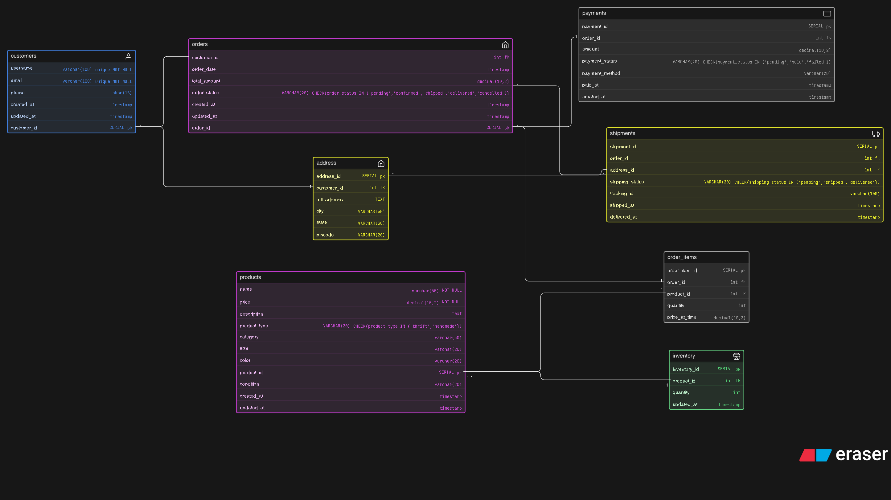
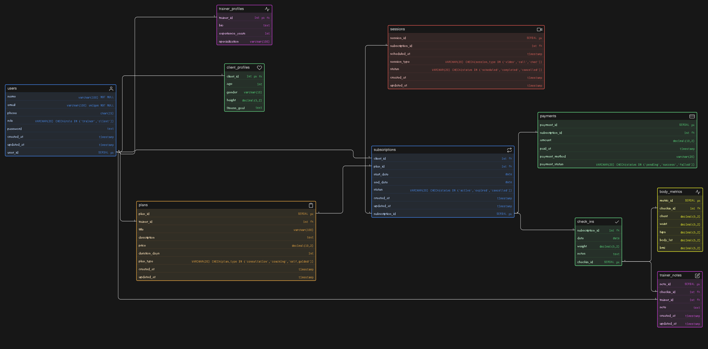
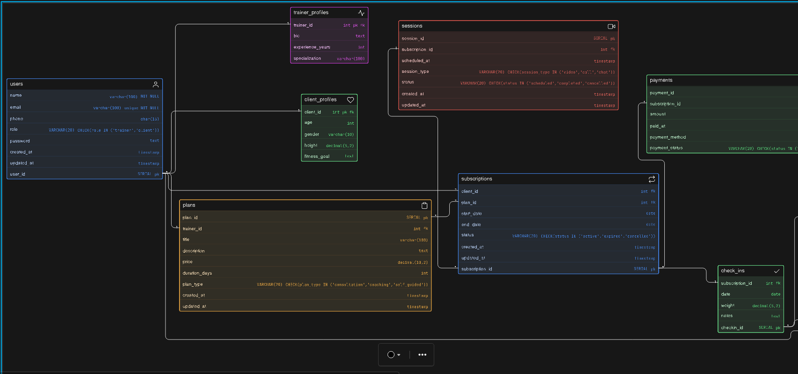
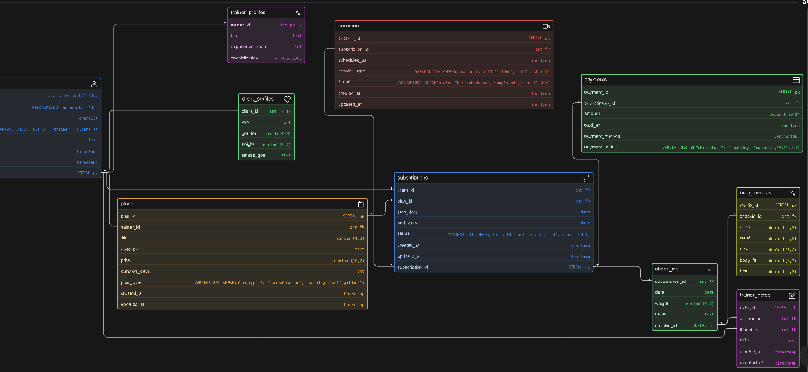

# Task 1 :Instagram Thrift Creator Store
Designed a database for an Instagram-based thrift and handmade store to manage products, inventory, orders, customers, and payments, while handling both unique (single-piece) and multi-unit items.

--------------------------------------------------------------------------------------------------------------------------------------------------------------------------
# Task 2: Online Fitness Coaching Platform (DB Design)
Designed a database for an online coaching platform where trainers manage clients, sell plans, schedule sessions, and track progress.

### Full Screenshot of ER Diagram:

### Part 1 of partial Screenshot of ER Diagram:

### Part 2 of partial Screenshot of ER Diagram:

