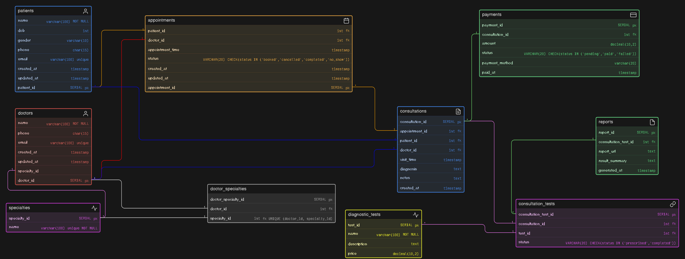
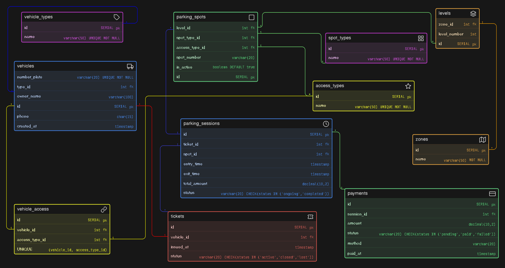
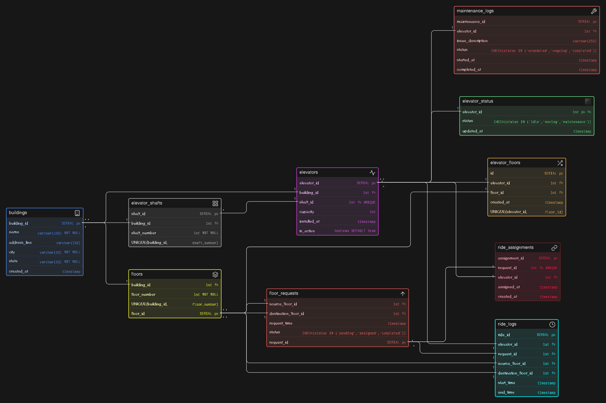

# Task 1 :Instagram Thrift Creator Store
Designed a database for an Instagram-based thrift and handmade store to manage products, inventory, orders, customers, and payments, while handling both unique (single-piece) and multi-unit items.

--------------------------------------------------------------------------------------------------------------------------------------------------------------------------
# Task 2: Online Fitness Coaching Platform (DB Design)
Designed a database for an online coaching platform where trainers manage clients, sell plans, schedule sessions, and track progress.

### Full Screenshot of ER Diagram:

### Part 1 of partial Screenshot of ER Diagram:

### Part 2 of partial Screenshot of ER Diagram:

# Task 3: Clinic Appointment and Diagnostics Platform

Designed a clean and scalable ER diagram for a clinic system that manages patients, doctors, appointments, consultations, diagnostic tests, reports, and payments.

# Task 4: Comic-Con Parking System

Designed a scalable multi-zone parking system that tracks vehicles, spot allocation, parking sessions, and payments with flexibility for different vehicle types and access categories.

# Task 5: Smart Elevator Control

Designed a clean and scalable ER diagram to manage buildings, elevators, floor requests, ride assignments, and maintenance with complete tracking of elevator operations and flow.

